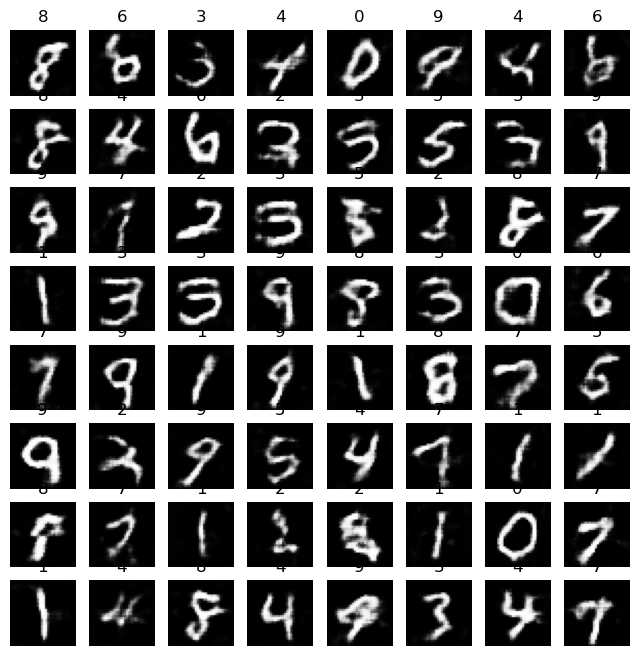
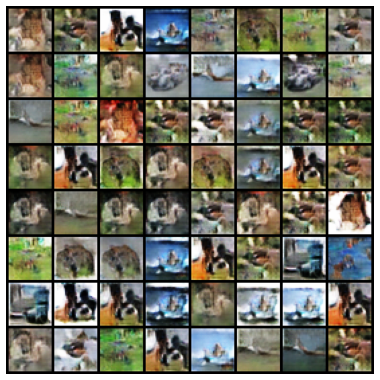

# Conditional-GANs-from-Scratch
Implementing Conditional Generative Adversarial Networks from scratch in PyTorch with Better Quality on CIFAR10 dataset.

## Conditional results on MNIST dataset

    

## Conditional results on CIFAR10 dataset

    

